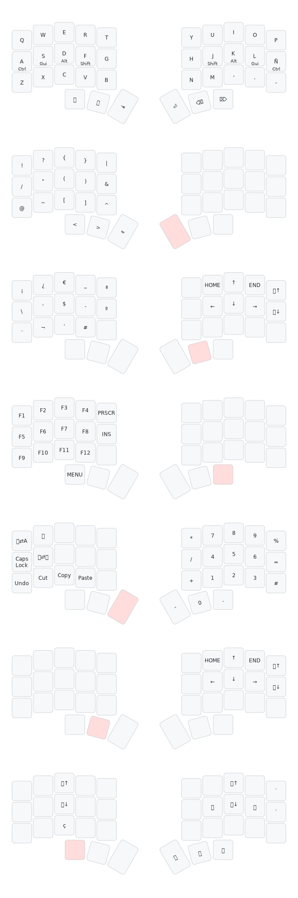

# QMK keymap

This is my keymap 3x5 spanish implementation for [foostan/crkbd corne keyboard](https://github.com/foostan/crkbd).



The keymap schema above was generated using keymap-drawer.

When modifications are done to the keymap, you can re-draw the schema by going to [keymap-drawer](https://keymap-drawer.streamlit.app/).

And pasting your modified [keymap.yaml file](./docs/keymap_custom.yaml) and executing.

## Prerequisites

### 1. qmk_firmware repo cloned/forked

To use this corne keymap you need to have the [qmk_firmware repo](https://github.com/qmk/qmk_firmware) cloned/forked.

### 2. QMK CLI installed and setup

You can find how to setup QMK on the [QMK Firmware docs website](https://docs.qmk.fm/newbs_getting_started#set-up-your-environment).

An error i encountered when installing QMK on my ubuntu was command qmk not being recognized, which i solved executing:

```sh
echo 'export PATH="$HOME/.local/bin:$PATH"' >> ~/.bashrc
source ~/.bashrc
```

## Installation guide

### 1. Clone the repo

Clone this repo under crkbd/keymaps in your qmk_firmware repository.

For example:

```sh
git clone https://github.com/MarcSepia/qmk_crkbd_sepia_3x5.git <your_qmk_repo_path>/keyboards/crkbd/keymaps/sepia_3x5
```

### 2. Build and flash the layout

This part here will be explained for a ProMicro RP2040 chip.
If you use a different MCU you could check:

- [How to compile](https://docs.qmk.fm/cli_commands#qmk-compile).
- [How to flash](https://docs.qmk.fm/cli_commands#qmk-flash).

#### 1. Compile the firmware:

```sh
qmk compile -kb crkbd -km sepia_3x5 -e CONVERT_TO=rp2040_ce
```

Using the qmk msys you can also compile with make

```sh
make crkbd:sepia_3x5 CONVERT_TO=rp2040_ce
```

#### 2. Flash the keyboard

1. Locate the generated `.uf2` file (it will also be saved in the `.build` directory).

2. Connect one side of the keyboard as an "external device" by entering bootloader mode. If both sides connected by TTRS is better to disconnect them before flashing.

3. Drag and drop the `.uf2` file onto the "external device" that appears in your system.

4. Repeat the process for the other half of the keyboard.

### Extra: Customization

- TODO

## Design guidelines

- Spanish friendly layout
- Simple, without tapdances nor combos
- Fast and comfortable response
- Easy learning curve
- BongoCat 😸
